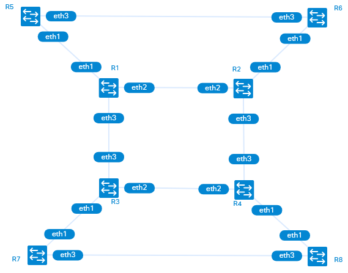

# Containerlab topology to support the exercises in Nokia Border Gateway Protocol for Internet Routing

As part of my exam preparation activities where I wanted to do workbook exercises without needing access to the Nokia BGP labs and looking for an excuse to learn how the containerlab templating features work (and justify some procrastination in actual study), this containerlab topology creates the routers, links and initial configurations to support doing the exercises in the  **Nokia Border Gateway Protocol for Internet Routing Lab Workbook - Revision 4.0 Jan 2022**




While audience that is interested in playing around with this particular workbook is probably quite small, hopefully this provides greater value as an example on how containerlab templating might be done.  I had previously done work with jinja2 based templates however containerlab uses the templating capability of *go* which is similar in some aspects or quite different in  others.

## Step #0 - Obtain Containerlab (this lab was developed using containerlab version 0.42.0)
https://containerlab.dev/install/

## Step #1 - Ensure that you have a SROS docker image and valid license key

If necessary edit bgp.yml to align with your environment (this lab is using SROS version 23.7.R1).

For instructions on creating a docker image if you have a https://containerlab.dev/manual/vrnetlab/
For a valid license key, reach out to your appropriate Nokia contact.

## Step #2 - Start the Container Lab Instance

This is where the 8 routers and associated interconnections described in *bgp.yml* will be instantiated

```
sudo containerlab deploy --reconfigure --topo bgp.yml
```

The *reconfigure* flag will ignore any previous router configurations that may have been saved (this may or may not be desired - exclude this flag as required)

## Step #3 - Wait until all of the routers are "Healthy"

Using the following command to check the operating state of each of the routers.  Typically it will take around 3 minutes for the routers to be available

Hit control-c to quit the watch

```
watch 'docker ps --format "Name: {{.Names}}, Status: {{.Status}}" | grep clab-bgp'
```

## Step #4 - Use the config template feature to push configs into each of the routers

When invoking the use of a template, containerlab will search for files that match the defined template with the "__<KIND>.tmpl" - in this case, ther are Nokia SROS routers (<KIND> = "vr-sros") in the topology, so the file used will be "baseconfig__vr-sros.tmpl"  the filepath "." refers to the current directory hosting the files for this particular containerlab

```
sudo containerlab config -t bgp.yml -p . -l baseconfig
```

While it is possible to define a partial configuration for each of the 8 routers in this topology - storing the relevant variables in the clab topology file (bgp.yml) and having a single template (baseconfig__vr-sros.tmpl) that supports per router configuration in a dynamic manner (meaning you can add or remove routers including modification of relevant attributes) in the bgp.yml file provides quite a bit of flexibilty to get containerlab up and running and ready for action quite quickly. 

The template configuration will be used to apply the following on each of the routers:
* Configures Ethernet Ports associated with Links defined in the bgp.yml topology
* Similarly configures IP interfaces associated with Links defined in the bgp.yml topology and binds them to the relevant ports
* Configures the Router system IP interface
* Enable IS-IS on IP interfaces that are expecting it
* Create extra loopback interfaces that the Lab Workbook expects

This templating feature may not be something that you plan to use outside of containerlab based deployments as other tools may be more appropriate, however the built in functionality does have the advantage of just needing containerlab and not other tools such as ansible and the like meaning that it should be more portable and shareable with other users.

## Step #5 - Start performing Lab Exercises

Now that the lab has been instantiated and the base configurations are in place, it is just a matter of connecting to the router of interest and performing the relevant lab tasks.

For example, if we want to work on R2, we can ssh into it and start doing things

```
ssh admin@clab-bgp-R2
```

